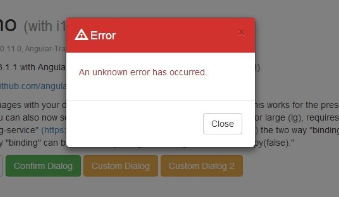

# inscription

## La mission

### 1. Projet

### 2. Description et images

* Vous avez l’image du projet normal et les état actifs, c’est à dire en passant la souris ou au clic
* Police d’écriture: https://fonts.google.com/specimen/Poppins en graisses 400 à 700
* La taille du texte de base doit être de 16px
* Rouge:  rgb(255, 122, 122)
* Vert:  rgb(56, 204, 140)
* Bleu (fond de la box en haut):  rgb(96, 85, 165)
* Bleu foncé (couleur du bord de l’input quand l’utilisateur à cliqué):  rgb(62, 60, 73)
* Gris clair (bord de l’input en temps normal + texte en bas du bouton vert):  rgb(185, 182,211)

### 3. Obligatoire

* L’utilisation de FlexBox
* Le respect de la police, des couleurs, des espacements.
* La publication sur GitHub
* Une structure de formulaire correcte et sémantique (exemple: remplir l’email avec le bon format)
* Le respect des états actifs

#### a : Bien à ajouter

* Le responsive, soit le fait d’adapter son design en mode téléphone. Pour cela, il suffit de diminuer sa fenêtre de navigateur, et de corriger les bugs grâce aux **media queries**
* L’addition de JavaScript: L’utilisateur aimerait recevoir un message d’erreur, sous forme d’alerte navigateur, s’il valide le formulaire avec un champ vide

### b : Bonus

* Améliorer le formulaire:
    * Que la page ne se recharge pas quand on clique sur le bouton submit
    * Qu’un message de validation apparaisse au dessus de la page indiquant: 
“ <email indiqué par l’utilisateur> now has free access for 7 days!”
    * Au lieu du message d’erreur sous forme d’alerte, améliorez votre design pour indiquer le message d’erreur sous forme de petite modale:

    